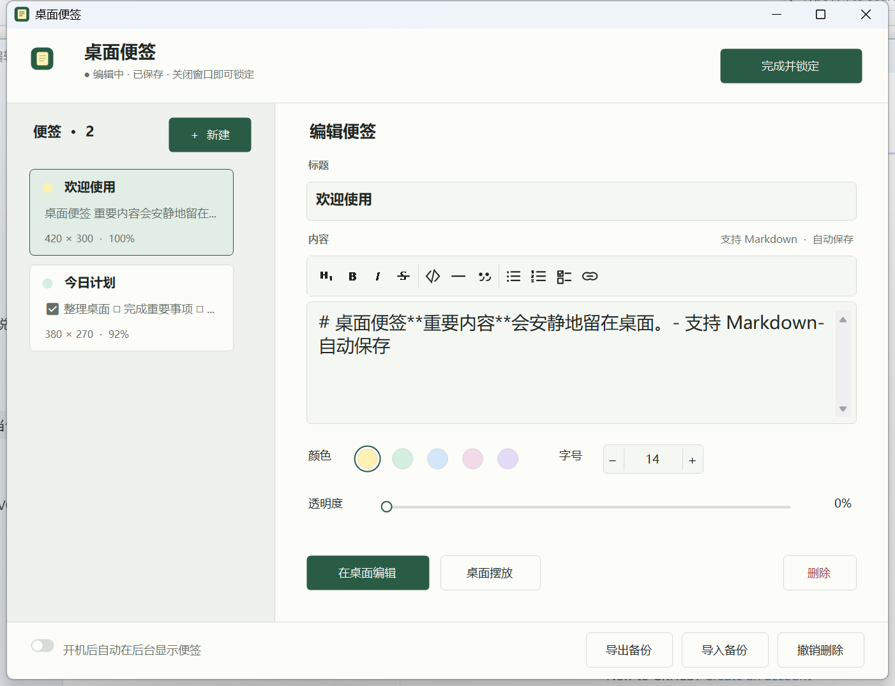

# 桌面便签

一款原生 Windows 桌面便签。锁定后，便签位于桌面图标与壁纸之间，不接收鼠标和键盘操作；需要修改时，可以打开管理窗口，也可以直接在桌面原位置编辑、拖动和缩放。



## 功能

- 多便签、自动保存和开机后台启动
- 桌面原位编辑、拖动与缩放
- 每张便签独立设置颜色、字号和透明度
- Markdown 标题、粗体、斜体、删除线、列表、任务框、引用、代码和链接样式
- 自绘 Markdown 工具栏、字号步进器、透明度滑块和开关
- 便签层位于桌面图标下方，锁定后完全点击穿透
- 多显示器坐标保存与断开显示器后的自动恢复
- 最近 30 次完整历史保存、损坏恢复、JSON 导入导出和撤销删除
- 本地离线运行，无账号、遥测或网络请求

## 下载与运行

在仓库的 **Releases** 页面下载便携版压缩包，解压后运行 `桌面便签.exe`。

系统要求：64 位 Windows 10/11，以及系统自带的 .NET Framework 4.8。程序无需安装和管理员权限。

数据保存在 exe 旁的 `data` 文件夹。升级时替换程序文件并保留该目录；迁移时复制整个便携版文件夹。

## 从源码构建

项目没有 NuGet 或网络依赖，使用 Windows 自带的 .NET Framework C# 编译器：

```powershell
.\build.ps1
.\build.ps1 -Test
```

默认输出到 `dist`。运行测试前，应从托盘退出正在运行的正式版，使真实桌面宿主检查可以独占测试窗口。

## 项目结构

```text
src/
├─ App.cs           程序入口、生命周期、托盘、单实例与开机启动
├─ Models.cs        数据模型、保存、历史快照、配色和位置恢复
├─ Windows.cs       管理窗口、桌面编辑器及自绘 UI 控件
├─ Markdown.cs      Markdown 编辑、解析和文本结构
├─ DesktopLayer.cs  便签绘制、桌面窗口层与桌面输入
├─ Native.cs        Windows API、Explorer 宿主与图标命中测试
├─ SelfTests.cs     数据、Markdown、桌面层和 UI 回归检查
└─ app.manifest     Windows 兼容与执行级别声明

design-system/
└─ desktop-paper-notes/MASTER.md  颜色、排版、控件和交互规范

tests/
├─ BitmapProbe.cs   桌面便签位图诊断工具
└─ README.md        诊断说明

build.ps1           无依赖构建与测试脚本
使用说明.md         完整用户手册
TESTING.md          自动检查和真实 Windows 环境验证范围
```

核心关系：

```text
Program
└─ NotesApp
   ├─ DataStore ── AppData / Note
   ├─ ManagerWindow ── MarkdownToolbar / 自绘控件
   ├─ NoteEditor ── MarkdownEditing
   ├─ DesktopLayer ── NoteRenderer ── MarkdownRenderer
   ├─ DesktopInput ── DesktopIconHitTest
   └─ Native ── Windows Shell / Win32 API
```

## 桌面层实现

每张锁定便签对应一个透明、不可激活且不显示在任务栏的原生窗口。软件寻找 Explorer 的桌面宿主，把便签窗口放在图标视图与壁纸合成窗口之间，并通过 `WS_EX_TRANSPARENT` 和 `WS_EX_NOACTIVATE` 保持点击穿透与焦点稳定。

编辑某张便签时，程序会在相同位置创建一个临时输入窗口，提供系统文本框、中文输入法和 Markdown 工具栏。编辑结束后，内容重新渲染到桌面层。

Windows 的桌面宿主属于未公开的 Shell 实现。程序会在 Explorer、分辨率和显示器配置变化后自动恢复连接，但未来的 Windows 更新仍可能改变这一行为。

## 数据安全

每次正式保存会先在 `data/versions` 写入并刷新一份独立快照，再更新 `notes.json` 和 `notes.json.bak`。程序最多保留 30 份历史保存。启动时优先读取最新有效快照；发现损坏文件时会保留原文件并尝试恢复上一版，无法安全恢复时暂停自动保存。

详细操作、数据字段、命令行参数、升级迁移和故障排查请阅读 [使用说明](使用说明.md)。完整设计约束见 [设计系统](design-system/desktop-paper-notes/MASTER.md)。

## 验证

当前版本通过 66 项自动检查，覆盖数据保存与恢复、Unicode、Markdown、透明度、屏幕位置、真实桌面窗口层级、点击穿透、后台启动、管理窗口、桌面原位编辑和高 DPI 布局。测试范围见 [测试说明](TESTING.md)。
